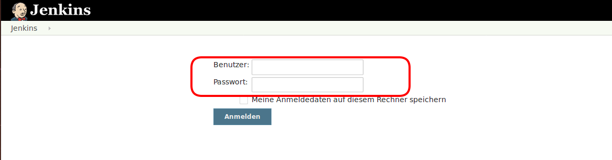
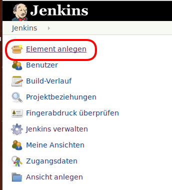
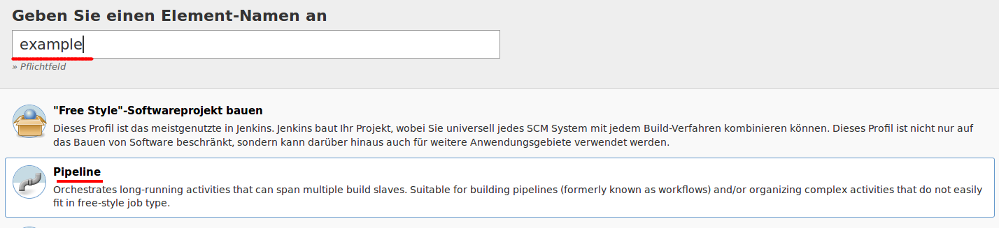
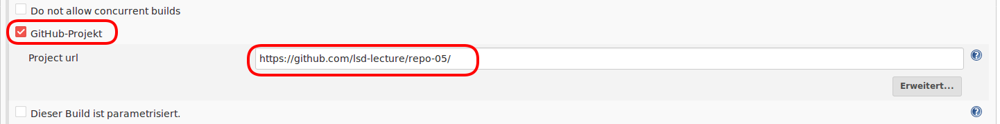
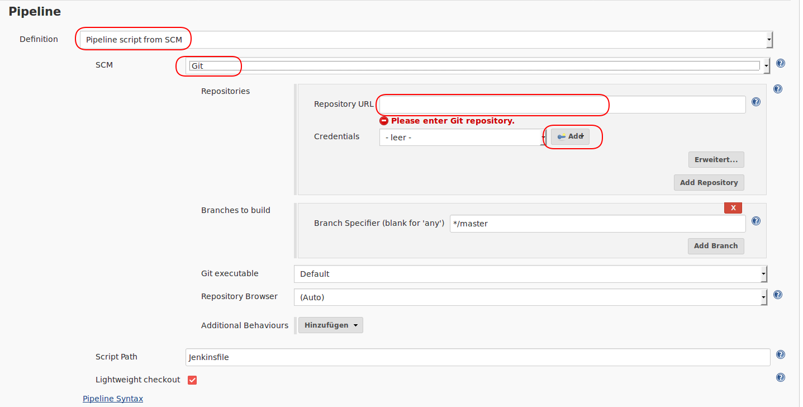
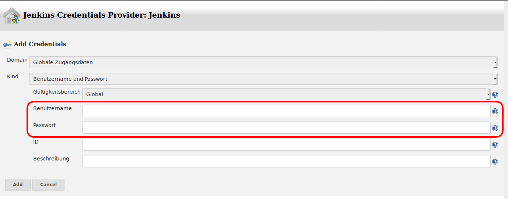
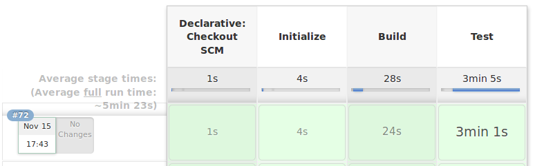

#  Assignment 5: Ein Butler für Sie
## Installation von Jenkins
Zur Installation von **Jenkins** per **SSH-Shell** mit dem Server verbinden und anschließend die in der Installationsanleitung beschriebene Schritte durchführen:

[Installationsanleitung](https://www.digitalocean.com/community/tutorials/how-to-install-jenkins-on-ubuntu-16-04#step-4-%E2%80%94-setting-up-jenkins)

**Jenkins** sollte anschließend über die URL http://**Adresse**:8080 erreichbar sein. Bei **Adresse** handelt es sich um die IP-Adresse des Servers.

## Konfiguration von Jenkins
1. **Jenkins** über die Browser URL http://**Adresse**:8080 aufrufen und über den zuvor angelegegten User einloggen.


2. Anschließend **Element anlegen** auswählen

    


3. Name eingeben und und Elementyp **Pipeline** auswählen.


4. Haken bei **GitHub-Projekt** setzen und Github URL des Repositories eingeben.


5. Pipeline nach dem Makierten Schema hinzufügen und Github Nutzer hinzufügen.


6. Github **Benutzername** und **Passwort** in die Makierten Felder eingeben und hinzufügen 

    

7. Zum Abschluss Speichern 

## Pipeline

### Initialisierug
Zuerst wird der build initialisiert. Das passiert, indem in das Projektverzeichniss gewechselt wird.
Danach wird der Befehl **maven clean** aufgerufen

```
 stage ('Initialize'){
            steps {
                sh 'echo hello from Initalize'
                sh 'echo BEIM INIT ---------$PWD'
                sh 'cd ./tomcat/apache-tomcat-6.0.53-src ; mvn clean'
            }
}

```
### Build
Bei dem **Build** **step** wird zuerst in das Projektverzeichniss gewechselt. Danach wird tomcat mit dem Befehl 
**mvn clean compile assembly:single**
das tomcat **jar** gebaut. Der dritte Befehlt ist ein list für das Ausgabeverzeichniss des **jars**.
Ist dieses nicht leer, wird ein Erfolg ( **"success"** ) Schritt eingeleitet. Dieser kopiert das tomcat **jar** aus dem Ausgabeverezeichniss in das Verzeichniss ```tomcat/bin```. Dabei werden bereits vorhandere Dateien überschrieben. Die Struktur ```tomcat/bin``` wird dabei, falls nicht vorhanden, erstellt. 

```
stage ('Build') {
            steps {
                sh 'echo hello from Build'
                sh 'cd ./tomcat/apache-tomcat-6.0.53-src ; mvn clean compile assembly:single' 
		sh 'ls ./tomcat/apache-tomcat-6.0.53-src/target/'
            }
		post{
			success{
				sh 'mkdir -p tomcat/bin; cp -uv ./tomcat/apache-tomcat-6.0.53-src/target/tomcat-6.0.53-jar-with-dependencies.jar tomcat/bin'
			}
		}
}
```

### Test
Für die Tests wird in das Projektverzeichniss gewechselt. Danach wird mit **mvn clean** ein Befehl zum säubern des Projektes ausgeführt. Anschließend werden mit dem **mvn test** Befehl die Tests von tomcat laufen gelassen. Bei einem **Error** wird dieser Schritt 
fehlschlagen. Bei Erfolg wird das aktuelle tomcat **jar** in das Benutzerverzeichniss in ```tomcat/bin``` kopiert. Auch hier wird die struktur angelegt, falls nicht vorhanden.
```
  stage ('Test') {
            steps {
		sh 'cd ./tomcat/apache-tomcat-6.0.53-src ; mvn clean'
                sh 'echo hello from Test'
                sh 'cd ./tomcat/apache-tomcat-6.0.53-src ; mvn test'   
            }
		post{
			success{
				sh 'mkdir -p ~/tomcat/bin; cp -uv ./tomcat/bin/tomcat-6.0.53-jar-with-dependencies.jar ~/tomcat/bin'
			}
		}
}
```

### Ergebniss
Anhand eines **Balkendiagramms** kann der Fortschritt des Prozesses für jeden einzelnen **step** mitverfolgt werden.



### Deployment
Wenn der Prozess Erfolgreich war, dann befindet sich im Homeverzeichniss ```~/tomcat/bin/``` eine ausführbare **jar** Datei.


## Probleme 
Da der bereitgestellte Server nur über das Hochschulnetz erreichbar ist konnte das **Github-Jenkins-Plugin** nicht über die **Jenkins-Hook-URL** einen Build Triggern.    (siehe [Anleitung](https://medium.com/@marc_best/trigger-a-jenkins-build-from-a-github-push-b922468ef1ae)) **Jenkins** wurde deshalb auf einen 5 Minuten Trigger-Intervall eingestell.
